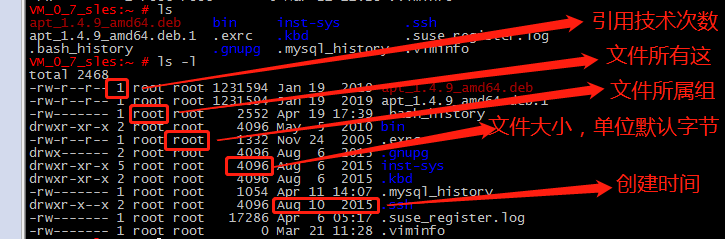
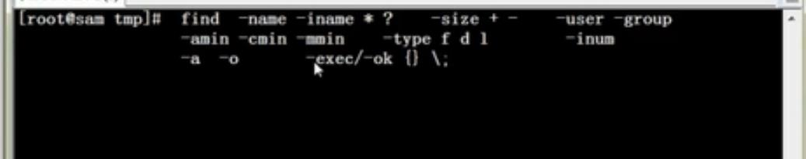
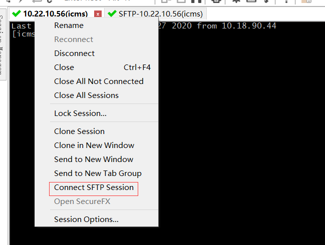
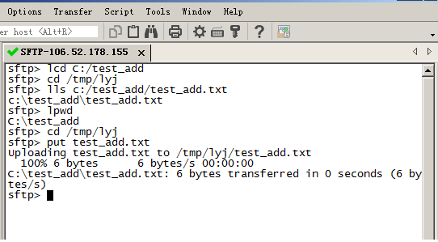

unix发展历史

### linux发展历史

内核相同,发行版本不一致

选择linux系统，以CentOS

### 第一讲、Linux系统简介

开源软件:apache、nginx、mysql、php、samba、python....

开源(开发源代码)并不是免费，

lamp:linux、apache、mysql、php(编程语言)

www.netcraft.com 踩点、扫描、访问的网站服务器是什么

为什么选择命令行：定位不同，一般不用图形界面

解决问题的智慧：不是马上问别人，

1.提示信息、帮助文档、示例、查找

2.英文的困惑：Command not found、No Such file or directory

linux中主要英文单词的背诵、

计划、坚持、专注、练习、

### 第二讲、linux系统安装

一、vmware虚拟机系统安装与使用

VMware官方网站：http://www.vmware.com

虚拟硬件设置：内存调整

有快照功能：当前设置记录

克隆：完整克隆复制当前的原始虚拟机

二、系统分区、

主分区：

扩展分区：

逻辑分区：

格式化（高级格式化对操作系统而言）：写入文件系统

文件系统例如默认：EXT4

进入格式化

block数据块

linux分区、格式化、分区直接建立硬件设备文件名

硬件设备文件名系统固定的。

分区设备文件名

分区设备文件名默认为硬件设备文件名加1，2系统固定

挂载：必须分区：/根分区，swap分区，推荐分区：/boot(启动分区，200MB)

正常使用步骤：分区-格式化-给分期建立硬件设备文件名-分区设备文件名-挂载点

/根目录linux最高目录

三、linux系统安装

设置密码原则：复杂性：8位字符以上、大小写字母、数字、符号、不能是英文单词 

四、远程登录管理工具

secureCRT 、winSCP、xftp和xshell

### 第三讲、给初学者的建议

linux命令及文件、用户名、配置文件严格区分大小写

linux中所有以文件的形式保存（硬盘、网段等也是写入的文件）

操作文件管理对应的硬件

linux不靠扩展名区分文件类型

不写如下这些也可以，约定俗称的写了更容易

压缩包：“*.gz”、“*.bz2”、"*tar.bz2"

linux各目录的作用

/bin/普通用户和超级用户都可以执行

服务器注意事项

远程服务器不允许关机，只能重启

重启时应该关闭服务

不要在服务器访问高峰运行高负载命令

远程配置防火墙时不要把自己踢出服务器（执行定时任务：每分钟清除等全部配置完）

防火墙作用：过滤、ip地址、mac地址、端口号、病毒伪装正常可以正常攻击电脑

制定合理规范密码定期更新、合理分配权限、定期备份重要数据和日志

### 第四讲、linux常用命令

#### 4.1文件处理命令

##### **4.1.1命令格式与目录处理命令ls**

命令格式：命令 [-选项] [参数]

eg: ls -la /etc

说明：

- 个别命令使用不遵循此格式
- 当有多个选项时，可以写在一起
- 简化选项与完整选项  -a 等于--all

ls 显示当前文件

ls -l 显示当前文件信息

ls -lh 文件大小不是默认字节单位

文件类型：-开头表示文件、d表示文件夹、l软链接

  
 
rw- r-- r--

所有者、所属组、o其他人

r读  w写 x执行

ls -a  显示所有文件，包括隐藏文件

ls -l   详细信息的显示

ls -d  查看目录属性

ls -i  查看文件对应的id

##### **4.1.2目录处理命令**

**目录处理命令 mkdir**

语法：mkdir -p  [目录名] 

eg: mkdir  -p  /tmp/[目录名]   创建新目录

-p 递归创建

eg: mkdir -p  /tmp/lyj/a /tmp/lyj/b

**目录处理命令pwd**

pwd:显示当前目录

**cd :切换目录**

cd /tmp/lyj

cd .. 返回上一级目录

**rmdir:删除空目录**

**cp:复制文件或目录**

语法：cp -rp[原文件或目录] [目标文件]

​           -r 复制目录

​           -p保留文件属性

复制的同时可以改名

eg:cp -r /tmp/lyj_2 /root/lyj

eg:cp /toot/a.log /tmp

**mv:剪切文件、改名**

eg:mv -/tmp/a /root/lyj

**rm:删除文件**

eg:rm /a/a.txt 删除文件

eg：rm -rf /root/a 删除目录（谨慎不能删除系统配置文件）

总结：mkdir、mkdir -p、cd  pwd cp -r -p 、mv、 rm -rf

##### 4.1.3文件处理命令

- touch: 创建文件

  eg:touch  /root/lyj/a.log  

  eg：touch /root/lyj/a b  空格表示创建2个文件

- cat :查看系统文件

  eg:  cat /root/a.txt

  tac反向显示

  more 比较长的文件内容，可以用空格键:翻页 、用回车键：换行、Q键：退出

  回翻文件内容可以用命令：less，eg:less /root/a.txt  

  less可以上下翻页和搜索（N表示next继续搜索）

  head:显示文件几行
  
  eg:head -n 7
  
  tail [文件名]  :显示文件后面的几行
  
  -n 指定文件后面几行、-f 动态显示文件末尾内容
  
  eg:tail -n  18 /etc/services

##### 4.1.4链接命令

**ln -s:创建软链接**

eg:ln -s a /tmp/a.rln -s a /tmp/a.r

- 软链接特征：类似于Windows快捷方式
- 1.权限默认：  l wrxwrxwrx   2文件大小-只是符号链接  3./tmp/a.r ->/tmp/a箭头指向源文件

硬链接特征：

拷贝cp -p 

硬链接实时备份、同步更新

通过i节点识别、i节点映射多个文件

硬链接不能夸分区（/tmp/a  类似D盘C盘）

硬链接不能针对目录使用

#### 4.2权限管理命令

##### 4.2.1  权限管理命令chmod

所有者：谁创建的只有1个、

如何更改文件权限？------一个文件只有所有者和root用户可以有权限

chmod [{ugoa}{+-=}] [文件或目录]  u所有者、g所属者、o其他人、a所有人

​             [mode=421]   [文件或目录]

​               -R递归修改

功能描述：改变文件或目录的权限

eg: chmod g+w,o-r lyj.txt

r  4、  w  2、 x   1    权限对应数字

532  r-x-wx-w-

数字对应的权限修改eg: chmod  532  lyj.txt

递归修改 a目录改为权限532，a目录下的子目录b, eg：chmod -R 532 /a/b

r w x 对文件权限

r w x 对目录权限     x进去该目录     r查看该目录权限

eg：对改目录下的文件有写的权限也就是对改目录下的 

删除一个文件的前提是对该文件所在的目录有写权限，若只对改文件有写权限是无法删除的  

##### 4.2.2其他权限管理命令

改变文件或目录的所有者  chown [用户] [文件或目录]

eg: chown liuyujuan    b  (改变文件b的所有者为liuyujuan )

不能使用无效的用户  

改变文件或目录的所属组 charp   [用户] [文件或目录]
eg:charg liu b  更改文件b的所属组为liu

- 谁创建的文件就是这个文件的所有者，文件的缺省组就文件的所属组。

**umsk [-S]**：可以线下文件缺省权限

touch 文件是没有可执行权限的

缺省创建的文件是没有可执行权限 	 

#### 4.3文件搜索命令

##### 4.3.1文件搜索命令find

Windows 搜索文件软件：Everything

linux搜索占用服务器资源

find [搜索范围] [匹配条件]

功能描述：文件搜索

eg:find  /etc  init  搜索etc下的文件名为init的文件

eg:find /etc -name* init *  包含init的文件

（inint???  以init开头结尾3个字符的文化、

eg ：eg:find /etc -iname* init *   -iname不区分大小写

eg:find / -size +204800  在根目录查找大于100MB的文件

+204800 大于  -204800小于  204800等于

1个数据块 512字节 0.5k

100MB=102400KB=204800

eg：find  /root  -user  lyj  在root目录查找所有者为lyj的文件

eg：find  /root  -group  lyj  在root目录查找所属组为lyj的文件

find   /etc -cmin -5

查找5分钟年内改变过属性的文件和目录

-amin 访问时间 access

-cmin 文件属性 change

-mmin 文件内容 modify

eg:find 、etc -size +163840 -a -size -204800

在/etc下查找大于80MB小于100MB的文件

-a 两个条件同时满足

-o两个条件满足任意一个即可

eg：find /etc -name lyj -excec ls -l{}\

在etc下查找lyj文件并显示其详细信息

-exec/-ok {}\;对文件的搜索

-type 根据文件类型查找

f 文件 d 目录 i软链接文件

-inum 根据i节点查找

eg: find . -nium 31531 -exec rm {}\.

在当前目录下删除i节点为31531的文件

  
 
##### 4.3.2其他命令搜索

文件搜索命令：locate

eg:locate lyj  查找文件lyj的文件位置    

速度快的原因：在文件资料库中查找文件，但是当新建的文件没有被收入资料库无法被查到。

相对应更新资料库命令  update

#### 4.4帮助命令

#### 4.5用户管理命令

#### 4.6压缩解压命令

#### 4.7网络命令

#### 4.8关机重启命令

- 附加：如何上传本地文件到服务器，以下步骤：
    
 

- lcd 到本地文件的目录下，比如：lcd D:/Invoke/
  cd 到服务器的目录，比如：cd /home/mysql/
  put 上传本地文件到服务器，比如：put liuyujuan.txt
  get 下载服务器到本地，比如：get liuyujian.txt

#### Linux常用命令：

> cd 切换目录
> ls 显示目录
> pwd 查看路径
> shutdown -r now 重启
> 文件和目录 
> cd /home 进入 '/ home' 目录' 
> cd .. 返回上一级目录 
> cd ../.. 返回上两级目录 
> cd ~user1 进入个人的主目录 
> pwd 显示工作路径 
> ls 查看目录中的文件 
> ls -F 查看目录中的文件 
> ls -l 显示文件和目录的详细资料 
> ls -a 显示隐藏文件 
>
> mkdir dir1 创建一个叫做 'dir1' 的目录' 
> mkdir dir1 dir2 同时创建两个目录
>
> mkdir -p /tmp/dir1/dir2 创建一个目录树 
>
> rm -f file1 删除一个叫做 'file1' 的文件' 
>
> rmdir dir1 删除一个叫做 'dir1' 的目录' 
>
> rm -rf dir1 删除一个叫做 'dir1' 的目录并同时删除其内容 
>
> rm -rf dir1 dir2 同时删除两个目录及它们的内容 
>
> mv dir1 new_dir 重命名/移动 一个目录 
>
> cp file1 file2 复制一个文件 
>
> cp -a /tmp/dir1 . 复制一个目录到当前工作目录 
> cp -a dir1 dir2 复制一个目录 
>
> 文件搜索 
> find / -name file1 从 '/' 开始进入根文件系统搜索文件和目录 
> find / -user user1 搜索属于用户 'user1' 的文件和目录 
> find /home/user1 -name \*.bin 在目录 '/ home/user1' 中搜索带有'.bin' 结尾的文件 
> find /usr/bin -type f -atime +100 搜索在过去100天内未被使用过的执行文件 
> find /usr/bin -type f -mtime -10 搜索在10天内被创建或者修改过的文件

​         